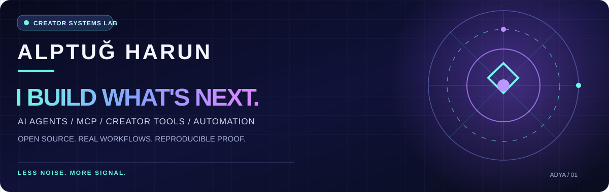

<div align="center">



**AI-NATIVE CREATOR SYSTEMS · OPEN SOURCE · PROOF-FIRST ENGINEERING**

[ENGLISH](README.md) · [TÜRKÇE](README_TR.md)

</div>

## 🚀 KISACA NE YAPIYORUM?

**İçerik üreticileri, geliştiriciler ve markalar için gerçek AI araçları** geliştiriyorum: Agent Skill, MCP sunucusu, içerik araştırması ve görsel üretim iş akışları. Amaç yalnızca fütüristik görünmek değil. **Çalıştır. İncele. Zorla. Geliştir.**

### ⌁ BAŞLANGIÇ NOKTANI SEÇ

| 01 / KEŞFEDİYORUM | 02 / GELİŞTİRİYORUM | 03 / İÇERİK ÜRETİYORUM |
| :--- | :--- | :--- |
| [**2 dakikalık test →**](https://github.com/alptugharun/ai-social-media-toolkit/blob/main/START-HERE.md) | [**MCP sunucusu →**](https://github.com/alptugharun/ai-workbench-mcp) | [**Frame Studio beta →**](https://github.com/alptugharun/ai-social-media-toolkit/tree/main/tools/creator-frame-studio) |
| Yerel testte ücretli model veya giriş gerekmez | Salt okunur prompt ve asistan araçları | Yerel sosyal medya görsel kadrajlama |

## ✦ ÜRÜN MERKEZİ

<table><tr><td width="50%" valign="top"><h3>⚡ AI SOCIAL MEDIA TOOLKIT</h3><p><strong>From idea to a working workflow.</strong></p><p>Agent Skills, assistants, creator workflows, reproducible first run.</p><a href="https://github.com/alptugharun/ai-social-media-toolkit/blob/main/START-HERE.md">▶ Run first proof</a> · <a href="https://github.com/alptugharun/ai-social-media-toolkit">Source</a></td><td width="50%" valign="top"><h3>🔌 AI WORKBENCH MCP</h3><p><strong>Small surface. Real utility.</strong></p><p>Three read-only tools for prompts and assistant blueprints.</p><a href="https://github.com/alptugharun/ai-workbench-mcp">▶ Setup &amp; diagnostics</a> · <a href="https://github.com/alptugharun/ai-workbench-mcp/issues/5">Host testing</a></td></tr><tr><td valign="top"><h3>🛡️ SKILL SAFETY AUDITOR</h3><p><strong>Inspect before you install.</strong></p><p>Offline, human-reviewable findings. Not a security certification.</p><a href="https://github.com/alptugharun/agent-skill-safety-auditor">▶ Try the scanner</a></td><td valign="top"><h3>📡 CREATOR SIGNAL LAB</h3><p><strong>Less guessing. More signal.</strong></p><p>Explainable CSV scoring for content opportunities and outlier posts.</p><a href="https://github.com/alptugharun/creator-signal-lab">▶ Explore examples</a></td></tr></table>

> **Deneysel alan:** [Creator Frame Studio beta](https://github.com/alptugharun/ai-social-media-toolkit/tree/main/tools/creator-frame-studio), görsel kadrajlama ve dışa aktarma aracıdır. [PR #167](https://github.com/alptugharun/ai-social-media-toolkit/pull/167) içindeki geliştirmeler birleşip doğrulanmadan yayımlanmış özellik sayılmaz.

## ⌘ ÖNCE TEST, SONRA GÜVEN

```bash
git clone https://github.com/alptugharun/ai-social-media-toolkit.git
cd ai-social-media-toolkit
python tools/first_run_check.py
```

Bu işlem **yerel doğrulama** sağlar; tüm AI platformlarının veya üretim sistemlerinin uyumluluğunu kanıtlamaz. [Kurulum/hata çözümü](https://github.com/alptugharun/ai-social-media-toolkit/blob/main/START-HERE.md) ve [güvenlik notları](https://github.com/alptugharun/ai-social-media-toolkit/blob/main/SECURITY.md) ile ilerle.

**KANIT MERDİVENİ:** Taslak → Yerel test → Gerçek uygulama ortamında doğrulama → Bağımsız kullanım kanıtı.

## 🧪 GELİŞTİRME LABORATUVARI

- **Creator Frame Studio v0.3 önerisi:** [PR #167](https://github.com/alptugharun/ai-social-media-toolkit/pull/167), henüz yayımlanmış özellik garantisi değil.
- **MCP yapılandırma ön kontrol önerisi:** [PR #151](https://github.com/alptugharun/ai-social-media-toolkit/pull/151), güvenlik sertifikası değil.
- **Creator araştırma araçları:** çevrimdışı puanlar canlı trend verisi veya virallik tahmini değildir.

## 🌐 PROFESYONEL GITHUB PROFİLİ FİKRİ

**En iyi GitHub profil README örnekleri** arayanlar için bu sayfada uyguladığım yaklaşım: özgün SVG kapak, iki dilde kolay gezinme, ürün kartları, çalışan komut örneği, alternatif metinler ve kontrol edilebilir kaynak bağlantıları. Sahte sıralama iddiaları, ziyaretçi sayacı veya zorunlu dinamik widget yok.

**Tasarım ilkesi:** Özgün görünüm dikkat çeker. Kullanışlı araçlar insanları tutar. Test ve sınırlamalar güven oluşturur.


**Yol haritasına katkı ver:** [💡 Fikir öner veya yapıcı eleştiri bırak](https://github.com/alptugharun/ai-social-media-toolkit/issues/169) · [Topluluk tartışmaları](https://github.com/alptugharun/ai-social-media-toolkit/discussions). Güvenlik açıklarını herkese açık paylaşma.

## ↗ GITHUB DIŞINDA

[Web sitesi / iş birliği](https://alptugharun.com) · [AI yazılarım](https://alptugharun.hashnode.dev) · [LinkedIn](https://www.linkedin.com/in/alptugharun/) · [Behance](https://www.behance.net/alptugharun/) · [Instagram](https://www.instagram.com/alptug.harun/)

Marka ve creator çalışmalarım: **ADYA Creative** ve **Yeşil Dijital Akademi**.

<div align="center">

### BOŞ GÖSTERİ DEĞİL. DAHA İYİ SİSTEMLER.

*İşe yarayanı geliştir. Kanıtını göster. Sınırını açıkla.*

</div>
